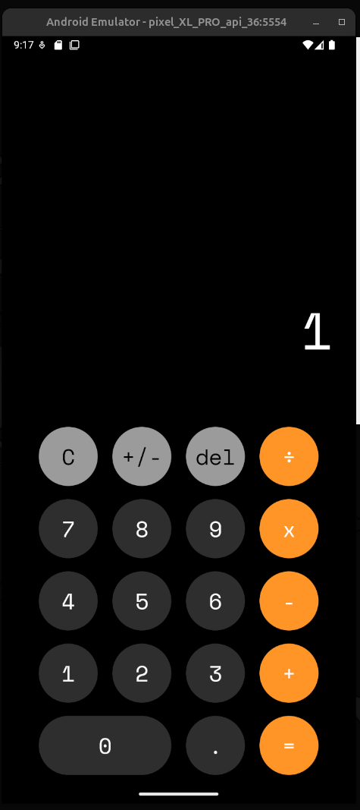

# Calculator App 🧮

A modern, feature-rich calculator application built with React Native and Expo. This calculator provides a clean, intuitive interface with support for basic arithmetic operations.



## Features

- ✨ Clean and modern UI with dark theme
- 🔢 Basic arithmetic operations (addition, subtraction, multiplication, division)
- ➕ Plus/minus toggle for negative numbers
- 🔄 Clear (C) and delete (del) functionality
- 📱 Responsive design optimized for mobile devices
- 🎨 Smooth animations and haptic feedback
- 🌓 Support for light and dark modes

## Tech Stack

- **React Native** - Cross-platform mobile development
- **Expo** - Development platform and tooling
- **TypeScript** - Type-safe code
- **Expo Router** - File-based navigation
- **Expo Haptics** - Tactile feedback

## Get Started

1. **Install dependencies**

   ```bash
   pnpm install
   ```

2. **Start the development server**

   ```bash
   pnpm start
   ```

3. **Run the app**

   In the output, you'll find options to open the app in:

   - [Development build](https://docs.expo.dev/develop/development-builds/introduction/)
   - [Android emulator](https://docs.expo.dev/workflow/android-studio-emulator/)
   - [iOS simulator](https://docs.expo.dev/workflow/ios-simulator/)
   - [Expo Go](https://expo.dev/go) - Quick testing on physical devices

## Project Structure

```
rn-calculator-app/
├── app/              # Main application screens (file-based routing)
├── components/       # Reusable UI components
├── hooks/            # Custom React hooks (calculator logic)
├── styles/           # Global styles and themes
├── constants/        # App constants and configuration
└── docs/             # Documentation and assets
```

## Development

You can start developing by editing the files inside the **app** directory. This project uses [file-based routing](https://docs.expo.dev/router/introduction) powered by Expo Router.

### Available Scripts

- `pnpm start` - Start the Expo development server

## Learn More

To learn more about the technologies used in this project:

- [Expo documentation](https://docs.expo.dev/) - Learn fundamentals and advanced topics
- [React Native documentation](https://reactnative.dev/) - Core framework documentation
- [Expo Router](https://docs.expo.dev/router/introduction/) - File-based navigation

## License

This project is open source and available under the MIT License.
